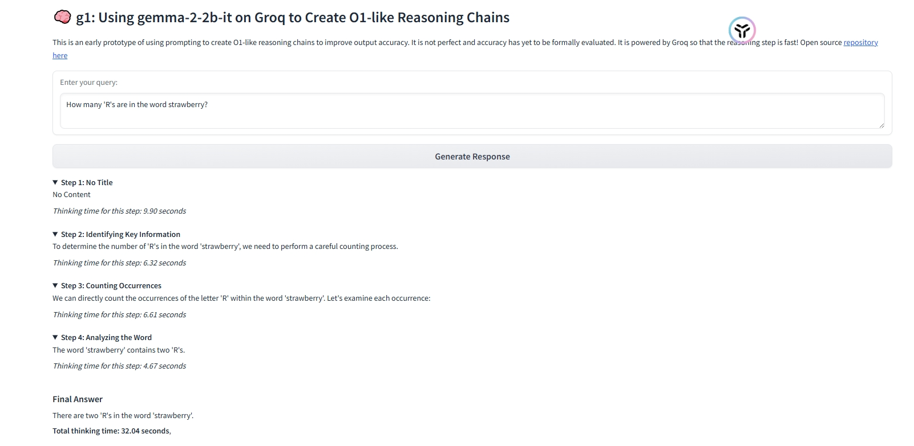

# 🧠 Cot(chain of thought)& RL(Reinforcement learning) liked open ai preview model 

# 🚀项目概述
该项目使用`google/gemma-2-2b-it`模型实现类似于o1模型的强化学习和思维链来提高模型的推理能力
# 💪项目结构
- cot： 实现思维链推理的实现
 - gradio 使用gradio框架进行思维链推理展示
 - ollama 使用ollmam来进行思维链推理展示
 - streamlit： 使用streamlit来实现思维链推理
- rl_train :实现基于强化学习的模型训练 
# 🔥如何启动
1. 创建虚拟环境
`conda create -n your_env_name python=3.10
2. 安装依赖\
`pip install -r requirements.txt`
3. 获取模型访问权限
3.1 登录huggingface,点击[google/gemma-2-2b-it]()获取模型访问权限。
首先运行`python access_token.py`实现本地登录huggingface
4. 配置config.yaml文件
config.yaml的默认配置如下：
```
model_name: "google/gemma-2-2b-it" 
access_token: "***************************"
learning_rate: 1e-5
epochs_stage_1: 2
epochs_stage_2: 3
beta_kl: 0.1
alpha: 1.0
data_file: "./data/SCoRe_Dataset_zh.csv"
```
配置中的access_token 需要自己登录huggingface账户去获取。
可复制config.yaml.templeate 到config.yaml使得配置生效。
`cp ./rl_train`<br>
`cp config.yaml.templeate config.yaml`

5. 强化学习启动
python run.py -f config.yaml
6. 思维链推理启动  
`cd cot`</br>
`cd gradio`

# 🌍结果展示
思维链输出：

强化学习输出
待写
# 🛡️参考论文
[Google Training Language Models to Self-Correct via reinforcement learning](https://arxiv.org/abs/2409.12917)
